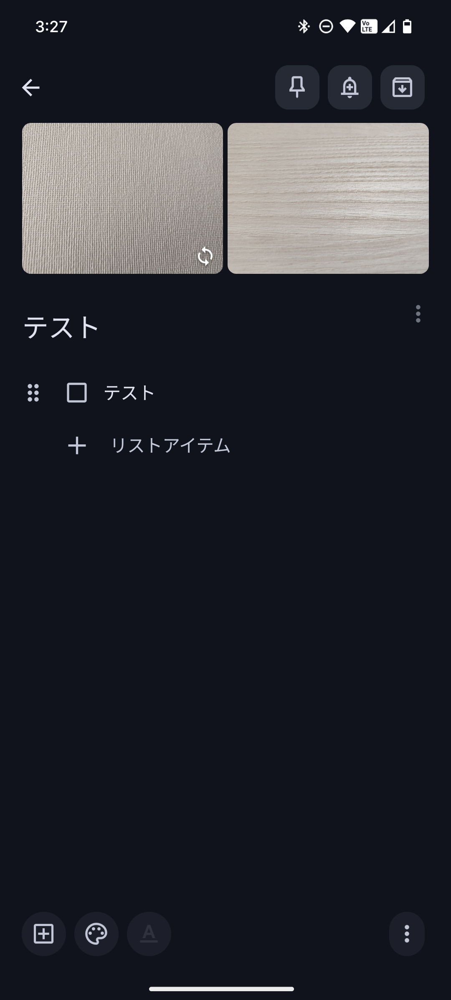
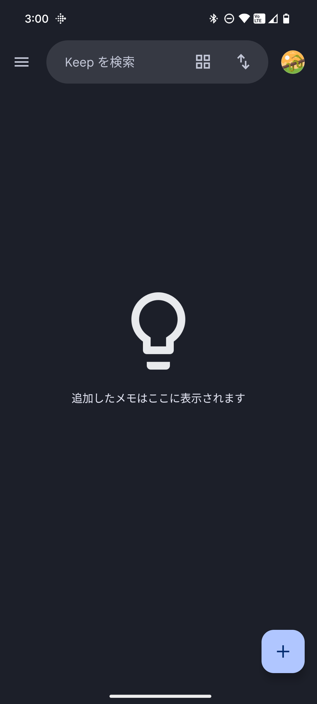
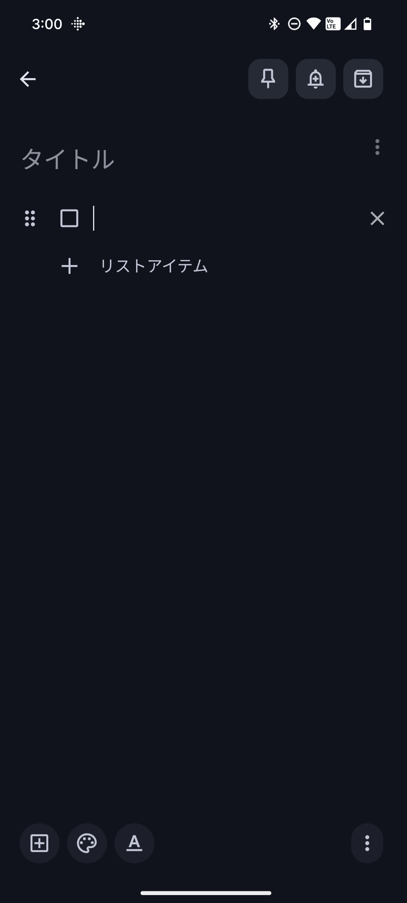
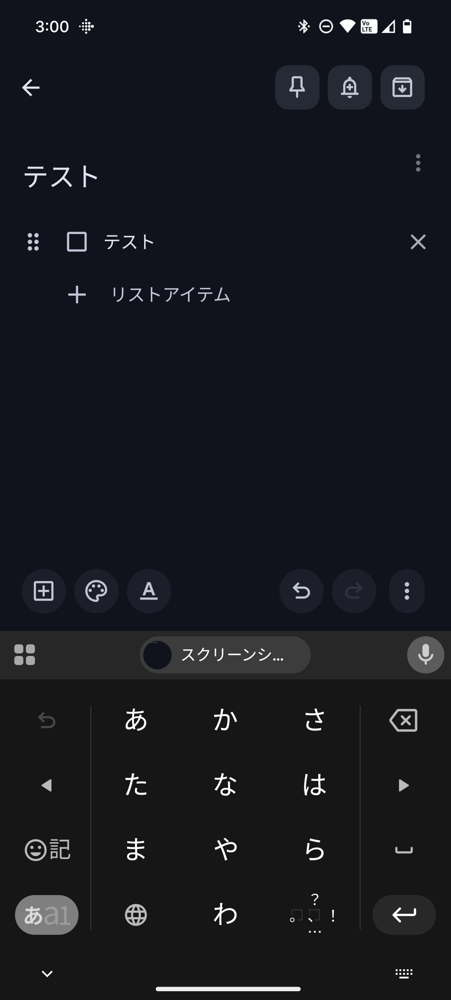
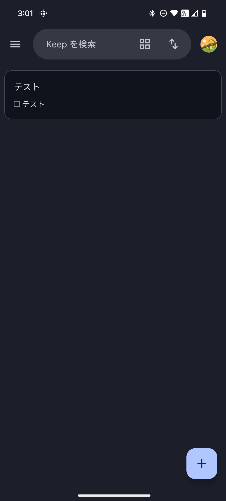

## TodoMap（開発中）
TodoMap は、タスクを地図のように捉えて整理・可視化することで、やることを迷わず前に進められるようにするアプリである。

## 作成するにあたる経緯
私は、普段Keepメモをtodoアプリとして使っている。
Keepメモは、「TODOリスト」に加え、「位置情報による通知」や「リマインダー」と多くの機能を備えている。
しかし1つ不満点がある。**画像が一番上に挿入されること**である。

これにより、TODOを完了した際その画像を削除するという手間がかかってしまうのである。
TODOに画像を埋めこみ、TODOを押下すると、画像が表示されるそういう仕様にしたい。
これを実現するために、TODOアプリを作成する。

## 要件
レイアウトは、Keepメモと類似のものとする。
機能は以下の項目を作成する。
- ホーム画面
- ノート
  - 位置情報による通知
  - リマインダー
  - TODO
  - TODOに画像を紐づけ

以下は、作成する画面のイメージである。（Keepメモのスクリーンショット）
- ホーム（初期状態）：空のボード。ここからノートやToDoを追加します。

    

- ノート（初期状態）：アイデアやメモを素早く記録します。

    

- ToDo：タスクの追加・編集。予測変換で入力を補助します。

    

- ホーム（ToDo追加後）：登録したタスクがカードとして表示され、全体を俯瞰できます。

    

## 追記
- 過去データを用いて分析を行い、次にやることを提案する機能を付けたい
